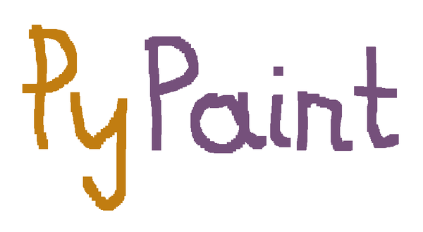
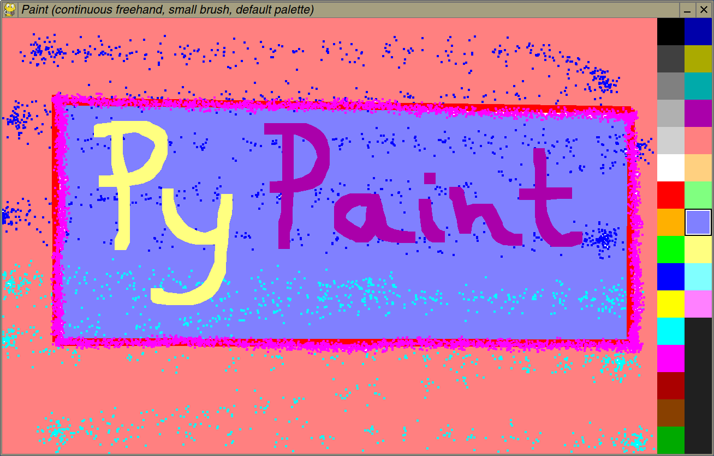

## PyPaint

A simple Python painting program for basic drawing and doodling. It is inspired by DeluxePaint and similar 1980s paint software.

Requires PyGame and NumPy (for the flood fill routine)

### Main features

* Fixed canvas size (1200x800 px), but can load pictures in other (smaller) sizes
* Four drawing tools: pen (dotted and continuous), airbrush, and flood fill
* Several included palettes
* Saves files as PNG with automatic filename selection

### Usage

    python pypaint.py [input image]

#### Mouse

* Paint with the left mouse button
* Change active color with the mouse wheel or by clicking on the palette
* Switch to next tool with the right mouse button
* Middle mouse button click switches brush size (large/small)

#### Keyboard

**P**: Switch to different ***p***alette

**T**: Switch drawing ***t***ool

**B**: Toggle ***b***rush size (large/small)

**H**: ***H***ide palette

**C**: ***C***olor picker: gets active color from pixel at mouse position
(color is added to palette if necessary)

**Space**: Erase drawing

**Return**: Save as PNG in current directory (filename based on date and time)

### Screenshot

