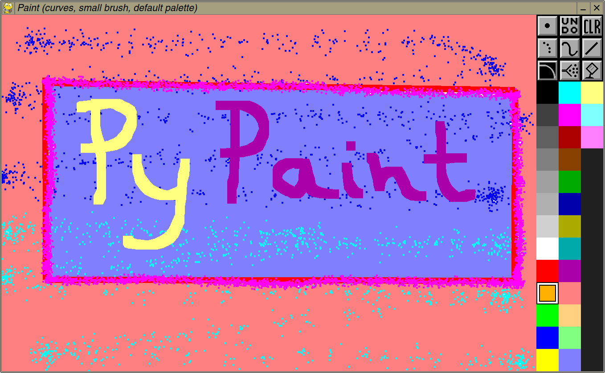

## PyPaint

A simple Python painting program for basic drawing and doodling. It is inspired by DeluxePaint and similar 1980s paint software.

Requires PyGame

### Main features

* Fixed canvas size (1200x800 px), but can load pictures in other sizes. (Images larger than the canvas are scaled down to fit.)
* Drawing tools: pen (dotted and continuous), straight lines, Bézier curves, airbrush, and flood fill
* Several included palettes
* Single-level undo
* Saves files as PNG with automatic filename selection

### Usage

    python pypaint.py [input image]

#### Mouse

* Paint with the left mouse button
* Change active color with the mouse wheel or by clicking on the palette
* Switch to next tool with the right mouse button
* Middle mouse button click switches brush size (large/small)

#### Keyboard

* **P**: Switch to different ***p***alette
* **T**: Switch drawing ***t***ool
* **B**: Toggle ***b***rush size (large/small)
* **M**: Toggle text ***m***arker / highlighter mode when using dotted pen (only draws where there is background color, leaving other colors as they are)
* **U**: ***U***ndo last painting operation
* **H**: ***H***ide palette
* **C**: ***C***olor picker: gets active color from pixel at mouse position
(color is added to palette if necessary)
* **Space**: Erase drawing (can be undone)
* **Return**: Save as PNG in current directory (filename based on date and time)

### License

Public Domain / CC0
